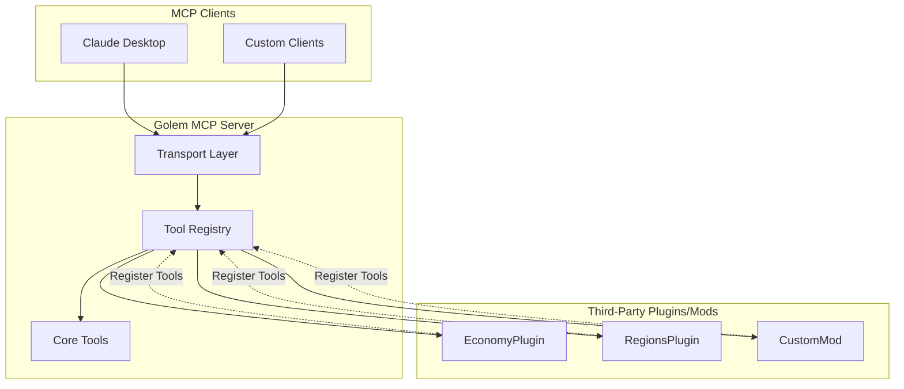

# Golem Add-on API Specification

## Overview

The Golem Add-on API allows other plugins and mods to register custom MCP tools with the Golem MCP server. This enables third-party developers to expose their plugin/mod functionality through the MCP protocol without implementing their own MCP server.

## Benefits

1. **Unified MCP Server** - Single MCP endpoint for all server functionality
2. **Easy Integration** - Simple API for registering tools
3. **Automatic Discovery** - Tools automatically appear in MCP tool listings
4. **Permission Integration** - Leverage Golem's permission system
5. **Transport Agnostic** - Tools work with both stdio and SSE transports

## Architecture



---

## API Dependency

### Maven Coordinates

```xml
<dependency>
    <groupId>com.keplersj.golem</groupId>
    <artifactId>golem-api</artifactId>
    <version>1.0.0</version>
    <scope>provided</scope>
</dependency>
```

### Gradle (Kotlin DSL)

```kotlin
dependencies {
    compileOnly("com.keplersj.golem:golem-api:1.0.0")
}
```

---

## Core API Interfaces

### 1. GolemAPI

Main entry point for accessing Golem functionality.

```kotlin
package com.keplersj.golem.api

interface GolemAPI {
    /**
     * Get the tool registry for registering custom tools
     */
    fun getToolRegistry(): ToolRegistry
    
    /**
     * Get the current Golem version
     */
    fun getVersion(): String
    
    /**
     * Check if Golem is enabled
     */
    fun isEnabled(): Boolean
    
    /**
     * Get the platform adapter for accessing server functionality
     */
    fun getPlatformAdapter(): PlatformAdapter
}
```

### 2. ToolRegistry

Registry for managing MCP tools.

```kotlin
package com.keplersj.golem.api

interface ToolRegistry {
    /**
     * Register a custom MCP tool
     * 
     * @param tool The tool to register
     * @throws IllegalArgumentException if tool name conflicts with existing tool
     */
    fun registerTool(tool: McpTool)
    
    /**
     * Unregister a custom MCP tool
     * 
     * @param toolName The name of the tool to unregister
     * @return true if tool was unregistered, false if not found
     */
    fun unregisterTool(toolName: String): Boolean
    
    /**
     * Get all registered tools
     * 
     * @return List of all registered tools
     */
    fun getAllTools(): List<McpTool>
    
    /**
     * Get a specific tool by name
     * 
     * @param toolName The name of the tool
     * @return The tool, or null if not found
     */
    fun getTool(toolName: String): McpTool?
    
    /**
     * Check if a tool is registered
     * 
     * @param toolName The name of the tool
     * @return true if registered, false otherwise
     */
    fun isToolRegistered(toolName: String): Boolean
}
```

### 3. McpTool

Interface for implementing custom MCP tools.

```kotlin
package com.keplersj.golem.api

import kotlinx.serialization.json.JsonObject

interface McpTool {
    /**
     * Unique name for the tool (must be unique across all tools)
     * Convention: use plugin/mod name as prefix (e.g., "economy_get_balance")
     */
    val name: String
    
    /**
     * Human-readable description of what the tool does
     */
    val description: String
    
    /**
     * JSON schema defining the tool's input parameters
     * Must be a valid JSON Schema object
     */
    val inputSchema: JsonObject
    
    /**
     * Optional permission required to use this tool
     * If null, no permission check is performed
     * Convention: use "golem.addon.<plugin>.<tool>" format
     */
    val requiredPermission: String?
        get() = null
    
    /**
     * Execute the tool with the given parameters
     * 
     * @param arguments The tool arguments as a JSON object
     * @param context Execution context with caller info and permissions
     * @return Tool result containing the response content
     * @throws ToolExecutionException if execution fails
     */
    suspend fun execute(
        arguments: JsonObject,
        context: ToolExecutionContext
    ): ToolResult
}
```

### 4. ToolExecutionContext

Context information provided during tool execution.

```kotlin
package com.keplersj.golem.api

import java.time.Instant

data class ToolExecutionContext(
    /**
     * Identifier of who/what is executing the tool
     * Could be "console", player name, or MCP client identifier
     */
    val executor: String,
    
    /**
     * Permissions available to the executor
     */
    val permissions: Set<String>,
    
    /**
     * Timestamp when the tool was called
     */
    val timestamp: Instant,
    
    /**
     * Platform adapter for accessing server functionality
     */
    val platformAdapter: PlatformAdapter,
    
    /**
     * Additional metadata about the execution
     */
    val metadata: Map<String, Any> = emptyMap()
) {
    /**
     * Check if executor has a specific permission
     */
    fun hasPermission(permission: String): Boolean {
        return permissions.contains(permission) || 
               permissions.contains("*") ||
               permissions.any { it.endsWith(".*") && permission.startsWith(it.removeSuffix(".*")) }
    }
}
```

### 5. ToolResult

Result returned from tool execution.

```kotlin
package com.keplersj.golem.api

sealed class ToolResult {
    /**
     * Successful tool execution
     */
    data class Success(
        val content: String,
        val metadata: Map<String, Any> = emptyMap()
    ) : ToolResult()
    
    /**
     * Tool execution failed
     */
    data class Error(
        val message: String,
        val code: Int = -32000,
        val data: Map<String, Any> = emptyMap()
    ) : ToolResult()
    
    companion object {
        fun success(content: String, metadata: Map<String, Any> = emptyMap()) = 
            Success(content, metadata)
        
        fun error(message: String, code: Int = -32000, data: Map<String, Any> = emptyMap()) = 
            Error(message, code, data)
    }
}
```

### 6. ToolExecutionException

Exception thrown during tool execution.

```kotlin
package com.keplersj.golem.api

class ToolExecutionException(
    message: String,
    val code: Int = -32000,
    val data: Map<String, Any> = emptyMap(),
    cause: Throwable? = null
) : Exception(message, cause)
```

---

## Usage Examples

### Example 1: Economy Plugin Integration

```kotlin
package com.example.economyplugin

import com.keplersj.golem.api.*
import kotlinx.serialization.json.*
import org.bukkit.plugin.java.JavaPlugin

class EconomyPlugin : JavaPlugin() {
    private lateinit var golemAPI: GolemAPI
    
    override fun onEnable() {
        // Get Golem API
        val golemPlugin = server.pluginManager.getPlugin("Golem")
        if (golemPlugin == null) {
            logger.warning("Golem not found - MCP integration disabled")
            return
        }
        
        golemAPI = golemPlugin as GolemAPI
        
        // Register tools
        registerMcpTools()
    }
    
    private fun registerMcpTools() {
        val registry = golemAPI.getToolRegistry()
        
        // Register balance check tool
        registry.registerTool(GetBalanceTool(this))
        
        // Register transfer money tool
        registry.registerTool(TransferMoneyTool(this))
        
        logger.info("Registered ${2} MCP tools with Golem")
    }
    
    override fun onDisable() {
        // Unregister tools
        if (::golemAPI.isInitialized) {
            val registry = golemAPI.getToolRegistry()
            registry.unregisterTool("economy_get_balance")
            registry.unregisterTool("economy_transfer_money")
        }
    }
}

class GetBalanceTool(
    private val plugin: EconomyPlugin
) : McpTool {
    override val name = "economy_get_balance"
    override val description = "Get a player's economy balance"
    override val requiredPermission = "golem.addon.economy.get_balance"
    
    override val inputSchema = buildJsonObject {
        put("type", "object")
        put("properties", buildJsonObject {
            put("player", buildJsonObject {
                put("type", "string")
                put("description", "Player username or UUID")
            })
        })
        put("required", buildJsonArray {
            add("player")
        })
    }
    
    override suspend fun execute(
        arguments: JsonObject,
        context: ToolExecutionContext
    ): ToolResult {
        val playerName = arguments["player"]?.jsonPrimitive?.content
            ?: return ToolResult.error("Missing 'player' parameter")
        
        val player = plugin.server.getOfflinePlayer(playerName)
        val balance = plugin.economy.getBalance(player)
        
        return ToolResult.success(
            "Player $playerName has a balance of $${"%.2f".format(balance)}",
            mapOf(
                "player" to playerName,
                "balance" to balance,
                "currency" to "USD"
            )
        )
    }
}

class TransferMoneyTool(
    private val plugin: EconomyPlugin
) : McpTool {
    override val name = "economy_transfer_money"
    override val description = "Transfer money between players"
    override val requiredPermission = "golem.addon.economy.transfer"
    
    override val inputSchema = buildJsonObject {
        put("type", "object")
        put("properties", buildJsonObject {
            put("from", buildJsonObject {
                put("type", "string")
                put("description", "Source player")
            })
            put("to", buildJsonObject {
                put("type", "string")
                put("description", "Destination player")
            })
            put("amount", buildJsonObject {
                put("type", "number")
                put("description", "Amount to transfer")
                put("minimum", 0.01)
            })
        })
        put("required", buildJsonArray {
            add("from")
            add("to")
            add("amount")
        })
    }
    
    override suspend fun execute(
        arguments: JsonObject,
        context: ToolExecutionContext
    ): ToolResult {
        val from = arguments["from"]?.jsonPrimitive?.content
            ?: return ToolResult.error("Missing 'from' parameter")
        val to = arguments["to"]?.jsonPrimitive?.content
            ?: return ToolResult.error("Missing 'to' parameter")
        val amount = arguments["amount"]?.jsonPrimitive?.double
            ?: return ToolResult.error("Missing 'amount' parameter")
        
        if (amount <= 0) {
            return ToolResult.error("Amount must be positive")
        }
        
        val fromPlayer = plugin.server.getOfflinePlayer(from)
        val toPlayer = plugin.server.getOfflinePlayer(to)
        
        // Check balance
        if (plugin.economy.getBalance(fromPlayer) < amount) {
            return ToolResult.error("Insufficient funds")
        }
        
        // Perform transfer
        plugin.economy.withdrawPlayer(fromPlayer, amount)
        plugin.economy.depositPlayer(toPlayer, amount)
        
        return ToolResult.success(
            "Transferred $${"%.2f".format(amount)} from $from to $to",
            mapOf(
                "from" to from,
                "to" to to,
                "amount" to amount,
                "from_balance" to plugin.economy.getBalance(fromPlayer),
                "to_balance" to plugin.economy.getBalance(toPlayer)
            )
        )
    }
}
```

### Example 2: Regions Plugin Integration

```kotlin
package com.example.regionsplugin

import com.keplersj.golem.api.*
import kotlinx.serialization.json.*

class ListRegionsTool(
    private val plugin: RegionsPlugin
) : McpTool {
    override val name = "regions_list"
    override val description = "List all protected regions"
    override val requiredPermission = "golem.addon.regions.list"
    
    override val inputSchema = buildJsonObject {
        put("type", "object")
        put("properties", buildJsonObject {
            put("world", buildJsonObject {
                put("type", "string")
                put("description", "World name (optional)")
            })
        })
    }
    
    override suspend fun execute(
        arguments: JsonObject,
        context: ToolExecutionContext
    ): ToolResult {
        val worldName = arguments["world"]?.jsonPrimitive?.content
        
        val regions = if (worldName != null) {
            plugin.regionManager.getRegions(worldName)
        } else {
            plugin.regionManager.getAllRegions()
        }
        
        val regionList = regions.joinToString("\n") { region ->
            "- ${region.name} (${region.world}): ${region.owners.size} owners, ${region.members.size} members"
        }
        
        return ToolResult.success(
            "Regions:\n$regionList",
            mapOf(
                "count" to regions.size,
                "regions" to regions.map { it.toMap() }
            )
        )
    }
}
```

### Example 3: Fabric Mod Integration

```kotlin
package com.example.custommod

import com.keplersj.golem.api.*
import kotlinx.serialization.json.*
import net.fabricmc.api.ModInitializer

class CustomMod : ModInitializer {
    override fun onInitialize() {
        // Wait for Golem to be available
        GolemAPI.getInstance()?.let { golem ->
            registerTools(golem)
        } ?: run {
            println("Golem not available - MCP integration disabled")
        }
    }
    
    private fun registerTools(golem: GolemAPI) {
        val registry = golem.getToolRegistry()
        registry.registerTool(CustomModTool())
    }
}

class CustomModTool : McpTool {
    override val name = "custommod_action"
    override val description = "Perform a custom mod action"
    override val requiredPermission = "golem.addon.custommod.action"
    
    override val inputSchema = buildJsonObject {
        put("type", "object")
        put("properties", buildJsonObject {
            put("action", buildJsonObject {
                put("type", "string")
                put("enum", buildJsonArray {
                    add("start")
                    add("stop")
                    add("status")
                })
            })
        })
        put("required", buildJsonArray {
            add("action")
        })
    }
    
    override suspend fun execute(
        arguments: JsonObject,
        context: ToolExecutionContext
    ): ToolResult {
        val action = arguments["action"]?.jsonPrimitive?.content
            ?: return ToolResult.error("Missing 'action' parameter")
        
        return when (action) {
            "start" -> {
                // Perform start action
                ToolResult.success("Custom mod action started")
            }
            "stop" -> {
                // Perform stop action
                ToolResult.success("Custom mod action stopped")
            }
            "status" -> {
                // Get status
                ToolResult.success("Custom mod is running")
            }
            else -> ToolResult.error("Unknown action: $action")
        }
    }
}
```

---

## API Access Patterns

### Paper Plugin

```kotlin
class MyPlugin : JavaPlugin() {
    private var golemAPI: GolemAPI? = null
    
    override fun onEnable() {
        // Option 1: Direct cast (if Golem is a hard dependency)
        golemAPI = server.pluginManager.getPlugin("Golem") as? GolemAPI
        
        // Option 2: Service provider (recommended)
        golemAPI = server.servicesManager.getRegistration(GolemAPI::class.java)?.provider
        
        golemAPI?.let { registerTools(it) }
    }
}
```

### Velocity Plugin

```kotlin
@Plugin(
    id = "myplugin",
    dependencies = [@Dependency(id = "golem", optional = true)]
)
class MyVelocityPlugin @Inject constructor(
    private val server: ProxyServer
) {
    @Subscribe
    fun onProxyInitialization(event: ProxyInitializeEvent) {
        server.pluginManager.getPlugin("golem").flatMap { plugin ->
            plugin.instance.map { it as GolemAPI }
        }.ifPresent { golem ->
            registerTools(golem)
        }
    }
}
```

### Fabric Mod

```kotlin
object MyMod : ModInitializer {
    override fun onInitialize() {
        // Golem provides a static accessor for Fabric
        GolemAPI.getInstance()?.let { golem ->
            registerTools(golem)
        }
    }
}
```

---

## Tool Naming Conventions

To avoid conflicts, follow these naming conventions:

1. **Prefix with plugin/mod name:** `economy_get_balance`, `regions_list`
2. **Use snake_case:** `custom_mod_action`, not `customModAction`
3. **Be descriptive:** `economy_transfer_money`, not `economy_transfer`
4. **Avoid generic names:** `economy_balance`, not `balance`

---

## Permission Conventions

Recommended permission format:

```
golem.addon.<plugin-name>.<tool-name>
```

Examples:
- `golem.addon.economy.get_balance`
- `golem.addon.economy.transfer`
- `golem.addon.regions.list`
- `golem.addon.regions.create`

---

## Events API

Golem provides events for tool registration lifecycle:

```kotlin
package com.keplersj.golem.api.events

/**
 * Called when a tool is registered
 */
data class ToolRegisteredEvent(
    val tool: McpTool,
    val source: String  // Plugin/mod that registered the tool
)

/**
 * Called when a tool is unregistered
 */
data class ToolUnregisteredEvent(
    val toolName: String,
    val source: String
)

/**
 * Called when a tool is executed
 */
data class ToolExecutedEvent(
    val toolName: String,
    val executor: String,
    val arguments: JsonObject,
    val result: ToolResult,
    val executionTime: Long  // milliseconds
)
```

### Listening to Events (Paper)

```kotlin
class MyPlugin : JavaPlugin(), Listener {
    @EventHandler
    fun onToolExecuted(event: ToolExecutedEvent) {
        if (event.toolName.startsWith("economy_")) {
            logger.info("Economy tool executed: ${event.toolName} by ${event.executor}")
        }
    }
}
```

---

## Best Practices

### 1. Validate Input

Always validate tool arguments before processing:

```kotlin
override suspend fun execute(
    arguments: JsonObject,
    context: ToolExecutionContext
): ToolResult {
    val player = arguments["player"]?.jsonPrimitive?.content
        ?: return ToolResult.error("Missing required parameter: player")
    
    if (player.isBlank()) {
        return ToolResult.error("Player name cannot be empty")
    }
    
    // Continue with execution
}
```

### 2. Use Descriptive Error Messages

Provide helpful error messages with suggestions:

```kotlin
return ToolResult.error(
    "Player not found: $playerName",
    data = mapOf(
        "player" to playerName,
        "suggestion" to "Use list_players to see online players"
    )
)
```

### 3. Include Metadata in Results

Provide structured data in addition to text:

```kotlin
return ToolResult.success(
    "Player $playerName has $balance coins",
    metadata = mapOf(
        "player" to playerName,
        "balance" to balance,
        "currency" to "coins",
        "timestamp" to System.currentTimeMillis()
    )
)
```

### 4. Handle Async Operations

Use coroutines for async operations:

```kotlin
override suspend fun execute(
    arguments: JsonObject,
    context: ToolExecutionContext
): ToolResult = withContext(Dispatchers.IO) {
    // Perform async operation
    val result = someAsyncOperation()
    ToolResult.success(result)
}
```

### 5. Clean Up on Disable

Always unregister tools when your plugin/mod is disabled:

```kotlin
override fun onDisable() {
    golemAPI?.getToolRegistry()?.let { registry ->
        registry.unregisterTool("economy_get_balance")
        registry.unregisterTool("economy_transfer_money")
    }
}
```

---

## API Module Structure

The Golem API will be published as a separate artifact:

```
golem-api/
├── build.gradle.kts
└── src/main/kotlin/com/keplersj/golem/api/
    ├── GolemAPI.kt
    ├── ToolRegistry.kt
    ├── McpTool.kt
    ├── ToolExecutionContext.kt
    ├── ToolResult.kt
    ├── ToolExecutionException.kt
    ├── PlatformAdapter.kt
    └── events/
        ├── ToolRegisteredEvent.kt
        ├── ToolUnregisteredEvent.kt
        └── ToolExecutedEvent.kt
```

---

## Documentation for Add-on Developers

A separate developer guide will be created covering:

1. Getting started with the Golem API
2. Creating your first MCP tool
3. Advanced tool patterns
4. Testing your tools
5. Publishing your add-on
6. Example add-ons

---

## Future Enhancements

1. **Resource API** - Allow add-ons to register MCP resources
2. **Prompt API** - Allow add-ons to register MCP prompts
3. **Tool Categories** - Organize tools by category
4. **Tool Dependencies** - Declare dependencies between tools
5. **Tool Versioning** - Support multiple versions of the same tool
6. **Hot Reload** - Reload add-on tools without restart
