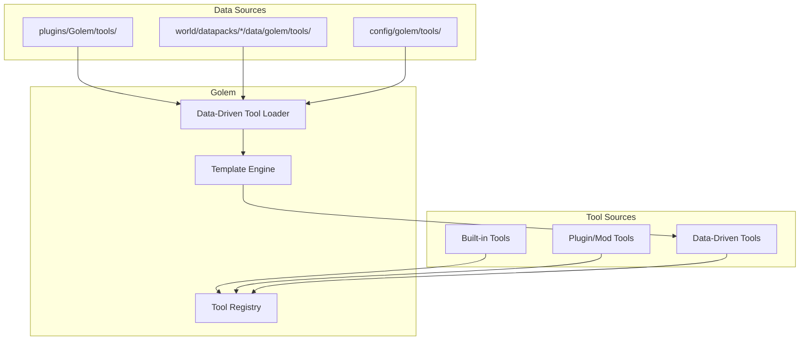

# Data-Driven MCP Tools Specification

## Overview

Data-driven tools allow server administrators and data pack creators to define custom MCP tools using JSON files, without writing any code. This follows Minecraft's data pack philosophy and makes Golem highly customizable.

## Benefits

1. **No Coding Required** - Define tools with JSON
2. **Data Pack Integration** - Tools can be distributed via data packs
3. **Hot-Reload** - Changes apply without restart
4. **Easy Customization** - Server admins can tweak tools
5. **Community Sharing** - Share tool definitions easily
6. **Rapid Prototyping** - Test tool ideas quickly

## Architecture



---

## Tool Definition Format

### Basic Structure

```json
{
  "name": "custom_tool_name",
  "description": "Human-readable description",
  "permission": "golem.custom.tool_name",
  "input_schema": {
    "type": "object",
    "properties": {
      "param1": {
        "type": "string",
        "description": "Parameter description"
      }
    },
    "required": ["param1"]
  },
  "actions": [
    {
      "type": "command",
      "command": "say Hello {param1}!"
    }
  ],
  "response": {
    "template": "Executed command for {param1}"
  }
}
```

### File Location

**Paper/Spigot:**
- `plugins/Golem/tools/*.json` - Plugin-level tools
- `world/datapacks/*/data/golem/tools/*.json` - Data pack tools

**Fabric:**
- `config/golem/tools/*.json` - Config-level tools
- `world/datapacks/*/data/golem/tools/*.json` - Data pack tools

**Velocity:**
- `plugins/golem/tools/*.json` - Proxy-level tools

---

## Action Types

### 1. Command Action

Execute a Minecraft command.

```json
{
  "type": "command",
  "command": "give {player} {item} {amount}",
  "as": "console"
}
```

**Parameters:**
- `command` - Command template with placeholders
- `as` - Who executes the command: `"console"` (default), `"player"`, `"executor"`

**Example:**
```json
{
  "name": "give_item",
  "description": "Give an item to a player",
  "input_schema": {
    "type": "object",
    "properties": {
      "player": { "type": "string" },
      "item": { "type": "string" },
      "amount": { "type": "integer", "default": 1 }
    },
    "required": ["player", "item"]
  },
  "actions": [
    {
      "type": "command",
      "command": "give {player} {item} {amount}"
    }
  ],
  "response": {
    "template": "Gave {amount} {item} to {player}"
  }
}
```

### 2. Multiple Commands

Execute multiple commands in sequence.

```json
{
  "type": "commands",
  "commands": [
    "gamemode creative {player}",
    "give {player} minecraft:diamond_sword 1",
    "tell {player} You are now in creative mode!"
  ]
}
```

### 3. Query Action

Query server data and return it.

```json
{
  "type": "query",
  "query": "player_info",
  "parameters": {
    "player": "{player}"
  }
}
```

**Built-in Queries:**
- `player_info` - Get player information
- `world_info` - Get world information
- `server_stats` - Get server statistics
- `online_players` - List online players

### 4. Conditional Action

Execute actions based on conditions.

```json
{
  "type": "conditional",
  "condition": {
    "type": "permission",
    "permission": "golem.admin"
  },
  "then": [
    {
      "type": "command",
      "command": "op {player}"
    }
  ],
  "else": [
    {
      "type": "response",
      "message": "You don't have permission to op players"
    }
  ]
}
```

**Condition Types:**
- `permission` - Check if executor has permission
- `player_online` - Check if player is online
- `world_exists` - Check if world exists
- `comparison` - Compare values

### 5. Loop Action

Execute actions for multiple items.

```json
{
  "type": "loop",
  "items": "{players}",
  "variable": "player",
  "actions": [
    {
      "type": "command",
      "command": "tell {player} {message}"
    }
  ]
}
```

### 6. Response Action

Return a custom response without executing commands.

```json
{
  "type": "response",
  "message": "Custom response message",
  "metadata": {
    "key": "value"
  }
}
```

---

## Template System

### Variable Substitution

Use `{variable_name}` for simple substitution:

```json
{
  "command": "give {player} {item} {amount}"
}
```

### Filters

Apply filters to variables:

```json
{
  "command": "say {message|uppercase}",
  "template": "Player count: {count|format:number}"
}
```

**Built-in Filters:**
- `uppercase` - Convert to uppercase
- `lowercase` - Convert to lowercase
- `capitalize` - Capitalize first letter
- `format:number` - Format as number
- `format:currency` - Format as currency
- `default:value` - Use default if null

### Expressions

Use simple expressions:

```json
{
  "template": "Total: {amount * price}"
}
```

---

## Complete Examples

### Example 1: Teleport Home

```json
{
  "name": "teleport_home",
  "description": "Teleport a player to their home",
  "permission": "golem.custom.teleport_home",
  "input_schema": {
    "type": "object",
    "properties": {
      "player": {
        "type": "string",
        "description": "Player to teleport"
      }
    },
    "required": ["player"]
  },
  "actions": [
    {
      "type": "conditional",
      "condition": {
        "type": "player_online",
        "player": "{player}"
      },
      "then": [
        {
          "type": "command",
          "command": "tp {player} ~ ~ ~",
          "comment": "This would use actual home coordinates in practice"
        }
      ],
      "else": [
        {
          "type": "response",
          "message": "Player {player} is not online"
        }
      ]
    }
  ],
  "response": {
    "template": "Teleported {player} to their home"
  }
}
```

### Example 2: Server Maintenance Mode

```json
{
  "name": "maintenance_mode",
  "description": "Toggle server maintenance mode",
  "permission": "golem.admin.maintenance",
  "input_schema": {
    "type": "object",
    "properties": {
      "enabled": {
        "type": "boolean",
        "description": "Enable or disable maintenance mode"
      },
      "message": {
        "type": "string",
        "description": "Maintenance message",
        "default": "Server is under maintenance"
      }
    },
    "required": ["enabled"]
  },
  "actions": [
    {
      "type": "conditional",
      "condition": {
        "type": "comparison",
        "left": "{enabled}",
        "operator": "==",
        "right": true
      },
      "then": [
        {
          "type": "command",
          "command": "whitelist on"
        },
        {
          "type": "loop",
          "items": "{online_players}",
          "variable": "player",
          "filter": {
            "type": "not_permission",
            "permission": "golem.admin"
          },
          "actions": [
            {
              "type": "command",
              "command": "kick {player} {message}"
            }
          ]
        }
      ],
      "else": [
        {
          "type": "command",
          "command": "whitelist off"
        }
      ]
    }
  ],
  "response": {
    "template": "Maintenance mode {enabled|ternary:enabled:disabled}"
  }
}
```

### Example 3: Batch Give Items

```json
{
  "name": "batch_give_items",
  "description": "Give items to multiple players",
  "permission": "golem.admin.batch_give",
  "input_schema": {
    "type": "object",
    "properties": {
      "players": {
        "type": "array",
        "items": { "type": "string" },
        "description": "List of player names"
      },
      "item": {
        "type": "string",
        "description": "Item to give"
      },
      "amount": {
        "type": "integer",
        "description": "Amount of items",
        "default": 1
      }
    },
    "required": ["players", "item"]
  },
  "actions": [
    {
      "type": "loop",
      "items": "{players}",
      "variable": "player",
      "actions": [
        {
          "type": "command",
          "command": "give {player} {item} {amount}"
        }
      ]
    }
  ],
  "response": {
    "template": "Gave {amount} {item} to {players|length} players"
  }
}
```

### Example 4: World Time Presets

```json
{
  "name": "set_time_preset",
  "description": "Set world time using presets",
  "permission": "golem.custom.time_preset",
  "input_schema": {
    "type": "object",
    "properties": {
      "world": {
        "type": "string",
        "description": "World name"
      },
      "preset": {
        "type": "string",
        "enum": ["dawn", "day", "noon", "dusk", "night", "midnight"],
        "description": "Time preset"
      }
    },
    "required": ["world", "preset"]
  },
  "actions": [
    {
      "type": "command",
      "command": "time set {preset|time_value}",
      "world": "{world}"
    }
  ],
  "response": {
    "template": "Set time to {preset} in {world}"
  },
  "filters": {
    "time_value": {
      "dawn": "0",
      "day": "1000",
      "noon": "6000",
      "dusk": "12000",
      "night": "13000",
      "midnight": "18000"
    }
  }
}
```

### Example 5: Economy Integration (Data Pack)

```json
{
  "name": "economy_daily_reward",
  "description": "Give daily reward to a player",
  "permission": "golem.economy.daily_reward",
  "input_schema": {
    "type": "object",
    "properties": {
      "player": {
        "type": "string",
        "description": "Player name"
      }
    },
    "required": ["player"]
  },
  "actions": [
    {
      "type": "query",
      "query": "scoreboard_value",
      "parameters": {
        "player": "{player}",
        "objective": "last_reward"
      },
      "store": "last_reward_time"
    },
    {
      "type": "conditional",
      "condition": {
        "type": "comparison",
        "left": "{current_time - last_reward_time}",
        "operator": ">=",
        "right": 86400
      },
      "then": [
        {
          "type": "commands",
          "commands": [
            "scoreboard players add {player} money 100",
            "scoreboard players set {player} last_reward {current_time}",
            "tell {player} You received your daily reward of 100 coins!"
          ]
        }
      ],
      "else": [
        {
          "type": "response",
          "message": "You already claimed your daily reward. Try again in {86400 - (current_time - last_reward_time)|format:duration}"
        }
      ]
    }
  ],
  "response": {
    "template": "Daily reward claimed for {player}"
  }
}
```

---

## Data Pack Integration

### Data Pack Structure

```
my_datapack/
├── pack.mcmeta
└── data/
    └── golem/
        └── tools/
            ├── teleport_home.json
            ├── give_starter_kit.json
            └── custom_commands.json
```

### pack.mcmeta

```json
{
  "pack": {
    "pack_format": 15,
    "description": "Custom Golem MCP Tools"
  },
  "golem": {
    "tools_version": 1
  }
}
```

### Tool Discovery

Golem automatically discovers tools from:
1. `plugins/Golem/tools/` - Always loaded
2. Active data packs in `world/datapacks/*/data/golem/tools/`
3. Reloaded when data packs are reloaded (`/reload`)

---

## Configuration

### Enable/Disable Data-Driven Tools

```yaml
golem:
  data_driven_tools:
    enabled: true
    
    # Load from plugin directory
    load_from_plugin: true
    
    # Load from data packs
    load_from_datapacks: true
    
    # Allow overriding built-in tools
    allow_override: false
    
    # Validate tool definitions strictly
    strict_validation: true
    
    # Maximum actions per tool (prevent abuse)
    max_actions: 50
```

### Tool-Specific Configuration

```yaml
golem:
  data_driven_tools:
    tools:
      teleport_home:
        enabled: true
        permission: "golem.custom.teleport_home"
      
      maintenance_mode:
        enabled: true
        permission: "golem.admin.maintenance"
```

---

## Security Considerations

### 1. Command Validation

All commands are validated before execution:
- Blacklisted commands are blocked
- Permission checks are enforced
- Variable injection is prevented

### 2. Permission Requirements

Data-driven tools require permissions:
- Default: `golem.datadriven.<tool_name>`
- Custom: Specified in tool definition
- Admin override: `golem.datadriven.*`

### 3. Resource Limits

Prevent abuse with limits:
- Maximum actions per tool: 50 (configurable)
- Maximum loop iterations: 100
- Command execution timeout: 5 seconds
- Maximum template depth: 10

### 4. Sandboxing

Data-driven tools run in a sandboxed environment:
- Cannot access file system
- Cannot execute arbitrary code
- Limited to predefined action types
- All commands go through permission checks

---

## Implementation Details

### Tool Loader

```kotlin
class DataDrivenToolLoader(
    private val config: GolemConfig,
    private val registry: ToolRegistry
) {
    fun loadTools() {
        // Load from plugin directory
        if (config.dataDrivenTools.loadFromPlugin) {
            loadFromDirectory(pluginToolsDir)
        }
        
        // Load from data packs
        if (config.dataDrivenTools.loadFromDatapacks) {
            loadFromDatapacks()
        }
    }
    
    private fun loadFromDirectory(dir: Path) {
        dir.listDirectoryEntries("*.json").forEach { file ->
            try {
                val tool = parseToolDefinition(file)
                registry.registerTool(tool)
            } catch (e: Exception) {
                logger.error("Failed to load tool from $file", e)
            }
        }
    }
}
```

### Data-Driven Tool Implementation

```kotlin
class DataDrivenTool(
    private val definition: ToolDefinition,
    private val actionExecutor: ActionExecutor,
    private val templateEngine: TemplateEngine
) : McpTool {
    override val name = definition.name
    override val description = definition.description
    override val inputSchema = definition.inputSchema
    override val requiredPermission = definition.permission
    
    override suspend fun execute(
        arguments: JsonObject,
        context: ToolExecutionContext
    ): ToolResult {
        // Create variable context
        val variables = arguments.toMap() + mapOf(
            "executor" to context.executor,
            "timestamp" to context.timestamp,
            "current_time" to System.currentTimeMillis()
        )
        
        // Execute actions
        val results = definition.actions.map { action ->
            actionExecutor.execute(action, variables, context)
        }
        
        // Generate response
        val response = templateEngine.render(
            definition.response.template,
            variables + results.associate { it.key to it.value }
        )
        
        return ToolResult.success(response)
    }
}
```

---

## Future Enhancements

1. **Visual Tool Builder** - Web UI for creating tools
2. **Tool Marketplace** - Share and download community tools
3. **Advanced Queries** - More built-in query types
4. **Custom Filters** - Define custom template filters
5. **Tool Composition** - Call other tools from tools
6. **Async Actions** - Support for delayed/scheduled actions
7. **Event Triggers** - Trigger tools on server events
8. **Tool Testing** - Built-in testing framework

---

## Migration Path

### From Code to Data-Driven

Existing code-based tools can be converted to data-driven:

**Before (Code):**
```kotlin
class GiveItemTool : McpTool {
    override suspend fun execute(...): ToolResult {
        val player = arguments["player"]
        val item = arguments["item"]
        server.dispatchCommand("give $player $item")
        return ToolResult.success("Gave $item to $player")
    }
}
```

**After (Data-Driven):**
```json
{
  "name": "give_item",
  "actions": [
    {
      "type": "command",
      "command": "give {player} {item}"
    }
  ],
  "response": {
    "template": "Gave {item} to {player}"
  }
}
```

---

## Best Practices

1. **Use Descriptive Names** - `teleport_home` not `tp_h`
2. **Validate Input** - Use JSON schema validation
3. **Provide Defaults** - Make tools easy to use
4. **Document Tools** - Clear descriptions
5. **Test Thoroughly** - Test with various inputs
6. **Version Tools** - Include version in file name
7. **Share Responsibly** - Only share safe tools

---

## Example Data Pack

A complete example data pack is available at:
`examples/golem-tools-datapack/`

This includes:
- Teleportation tools
- Economy tools
- World management tools
- Player management tools
- Custom game mechanics
