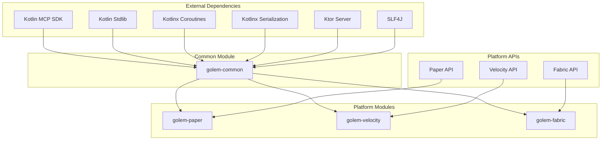

# Golem - Dependencies and Build Configuration

## Overview

This document outlines all dependencies and build configuration for the Golem MCP server plugin/mod.

## Kotlin MCP SDK

**Primary Dependency:** Official Kotlin MCP SDK from Anthropic

- **Repository:** https://github.com/modelcontextprotocol/kotlin-sdk
- **Maven Coordinates:** `io.modelcontextprotocol:kotlin-sdk`
- **Purpose:** Complete MCP protocol implementation, transports, and tool framework

### What the SDK Provides

1. **MCP Protocol Implementation**
   - JSON-RPC 2.0 message handling
   - Protocol version negotiation
   - Capability exchange
   - Request/response parsing

2. **Transport Layer**
   - `StdioServerTransport` - stdio communication
   - `SseServerTransport` - Server-Sent Events over HTTP
   - Transport abstraction interface

3. **Tool Framework**
   - `Tool` interface for implementing tools
   - Automatic JSON schema generation
   - Tool registration and discovery
   - Execution framework with error handling

4. **Server Infrastructure**
   - `Server` class for MCP server instances
   - `ServerOptions` for configuration
   - `Implementation` for server metadata

### SDK Sample Reference

The SDK includes a sample server implementation:
https://github.com/modelcontextprotocol/kotlin-sdk/tree/main/samples/kotlin-mcp-server

This sample demonstrates:
- Basic server setup
- Tool implementation
- Transport configuration
- Error handling

---

## Gradle Version Catalog

### [`gradle/libs.versions.toml`](../gradle/libs.versions.toml)

```toml
[versions]
kotlin = "1.9.22"
kotlinx-coroutines = "1.7.3"
kotlinx-serialization = "1.6.2"
mcp-sdk = "0.1.0"  # Check latest version
ktor = "2.3.7"
slf4j = "2.0.9"
logback = "1.4.14"

# Platform versions
paper = "1.21.10-R0.1-SNAPSHOT"
velocity = "3.3.0-SNAPSHOT"
fabric-loader = "0.15.3"
fabric-api = "0.92.2+1.21"
fabric-kotlin = "1.10.16+kotlin.1.9.22"

# Testing
junit = "5.10.1"
mockk = "1.13.8"

[libraries]
# Kotlin
kotlin-stdlib = { module = "org.jetbrains.kotlin:kotlin-stdlib", version.ref = "kotlin" }
kotlinx-coroutines-core = { module = "org.jetbrains.kotlinx:kotlinx-coroutines-core", version.ref = "kotlinx-coroutines" }
kotlinx-serialization-json = { module = "org.jetbrains.kotlinx:kotlinx-serialization-json", version.ref = "kotlinx-serialization" }

# MCP SDK
mcp-sdk = { module = "io.modelcontextprotocol:kotlin-sdk", version.ref = "mcp-sdk" }

# Ktor (used by MCP SDK for SSE)
ktor-server-core = { module = "io.ktor:ktor-server-core", version.ref = "ktor" }
ktor-server-netty = { module = "io.ktor:ktor-server-netty", version.ref = "ktor" }
ktor-server-sse = { module = "io.ktor:ktor-server-sse", version.ref = "ktor" }

# Logging
slf4j-api = { module = "org.slf4j:slf4j-api", version.ref = "slf4j" }
logback-classic = { module = "ch.qos.logback:logback-classic", version.ref = "logback" }

# Platform APIs
paper-api = { module = "io.papermc.paper:paper-api", version.ref = "paper" }
velocity-api = { module = "com.velocitypowered:velocity-api", version.ref = "velocity" }
fabric-loader = { module = "net.fabricmc:fabric-loader", version.ref = "fabric-loader" }
fabric-api = { module = "net.fabricmc.fabric-api:fabric-api", version.ref = "fabric-api" }
fabric-kotlin = { module = "net.fabricmc:fabric-language-kotlin", version.ref = "fabric-kotlin" }

# Testing
junit-jupiter = { module = "org.junit.jupiter:junit-jupiter", version.ref = "junit" }
mockk = { module = "io.mockk:mockk", version.ref = "mockk" }
kotlinx-coroutines-test = { module = "org.jetbrains.kotlinx:kotlinx-coroutines-test", version.ref = "kotlinx-coroutines" }

[plugins]
kotlin-jvm = { id = "org.jetbrains.kotlin.jvm", version.ref = "kotlin" }
kotlin-serialization = { id = "org.jetbrains.kotlin.plugin.serialization", version.ref = "kotlin" }
shadow = { id = "com.github.johnrengelman.shadow", version = "8.1.1" }
```

---

## Root Build Configuration

### [`build.gradle.kts`](../build.gradle.kts)

```kotlin
plugins {
    alias(libs.plugins.kotlin.jvm) apply false
    alias(libs.plugins.kotlin.serialization) apply false
    alias(libs.plugins.shadow) apply false
}

group = "com.keplersj.golem"
version = "1.0.0"

subprojects {
    apply(plugin = "org.jetbrains.kotlin.jvm")
    
    repositories {
        mavenCentral()
        maven("https://repo.papermc.io/repository/maven-public/")
        maven("https://maven.fabricmc.net/")
        maven("https://repo.velocitypowered.com/snapshots/")
    }
    
    dependencies {
        // Common Kotlin dependencies for all modules
        implementation(rootProject.libs.kotlin.stdlib)
        implementation(rootProject.libs.kotlinx.coroutines.core)
        
        // Testing
        testImplementation(rootProject.libs.junit.jupiter)
        testImplementation(rootProject.libs.mockk)
        testImplementation(rootProject.libs.kotlinx.coroutines.test)
    }
    
    tasks.withType<org.jetbrains.kotlin.gradle.tasks.KotlinCompile> {
        kotlinOptions {
            jvmTarget = "21"
            freeCompilerArgs = listOf("-Xjsr305=strict")
        }
    }
    
    tasks.withType<Test> {
        useJUnitPlatform()
    }
}
```

---

## Common Module Build

### [`common/build.gradle.kts`](../common/build.gradle.kts)

```kotlin
plugins {
    alias(libs.plugins.kotlin.jvm)
    alias(libs.plugins.kotlin.serialization)
}

dependencies {
    // MCP SDK - Primary dependency
    api(libs.mcp.sdk)
    
    // Kotlin
    api(libs.kotlinx.serialization.json)
    
    // Logging
    api(libs.slf4j.api)
    
    // Ktor (for SSE transport)
    implementation(libs.ktor.server.core)
    implementation(libs.ktor.server.netty)
    implementation(libs.ktor.server.sse)
}

java {
    toolchain {
        languageVersion.set(JavaLanguageVersion.of(21))
    }
}
```

---

## Paper Module Build

### [`paper/build.gradle.kts`](../paper/build.gradle.kts)

```kotlin
plugins {
    alias(libs.plugins.kotlin.jvm)
    alias(libs.plugins.shadow)
}

dependencies {
    // Common module
    implementation(project(":common"))
    
    // Paper API
    compileOnly(libs.paper.api)
    
    // Logging (Paper provides SLF4J)
    compileOnly(libs.slf4j.api)
}

java {
    toolchain {
        languageVersion.set(JavaLanguageVersion.of(21))
    }
}

tasks.shadowJar {
    archiveClassifier.set("")
    
    // Relocate dependencies to avoid conflicts
    relocate("kotlin", "com.keplersj.golem.libs.kotlin")
    relocate("kotlinx", "com.keplersj.golem.libs.kotlinx")
    relocate("io.ktor", "com.keplersj.golem.libs.ktor")
    relocate("io.modelcontextprotocol", "com.keplersj.golem.libs.mcp")
    
    // Minimize JAR size
    minimize {
        exclude(dependency("io.modelcontextprotocol:.*"))
    }
}

tasks.build {
    dependsOn(tasks.shadowJar)
}

tasks.processResources {
    val props = mapOf("version" to version)
    inputs.properties(props)
    filteringCharset = "UTF-8"
    filesMatching("plugin.yml") {
        expand(props)
    }
}
```

---

## Velocity Module Build

### [`velocity/build.gradle.kts`](../velocity/build.gradle.kts)

```kotlin
plugins {
    alias(libs.plugins.kotlin.jvm)
    alias(libs.plugins.shadow)
    alias(libs.plugins.kotlin.kapt)
}

dependencies {
    // Common module
    implementation(project(":common"))
    
    // Velocity API
    compileOnly(libs.velocity.api)
    kapt(libs.velocity.api)
    
    // Logging
    implementation(libs.slf4j.api)
    implementation(libs.logback.classic)
}

java {
    toolchain {
        languageVersion.set(JavaLanguageVersion.of(21))
    }
}

tasks.shadowJar {
    archiveClassifier.set("")
    
    // Relocate dependencies
    relocate("kotlin", "com.keplersj.golem.libs.kotlin")
    relocate("kotlinx", "com.keplersj.golem.libs.kotlinx")
    relocate("io.ktor", "com.keplersj.golem.libs.ktor")
    relocate("io.modelcontextprotocol", "com.keplersj.golem.libs.mcp")
}

tasks.build {
    dependsOn(tasks.shadowJar)
}
```

---

## Fabric Module Build

### [`fabric/build.gradle.kts`](../fabric/build.gradle.kts)

```kotlin
plugins {
    alias(libs.plugins.kotlin.jvm)
    alias(libs.plugins.fabric.loom)
}

dependencies {
    // Common module
    include(project(":common"))
    implementation(project(":common"))
    
    // Fabric
    minecraft("com.mojang:minecraft:1.21")
    mappings("net.fabricmc:yarn:1.21+build.1:v2")
    modImplementation(libs.fabric.loader)
    modImplementation(libs.fabric.api)
    modImplementation(libs.fabric.kotlin)
    
    // Include MCP SDK in mod
    include(libs.mcp.sdk)
}

java {
    toolchain {
        languageVersion.set(JavaLanguageVersion.of(21))
    }
}

tasks.processResources {
    inputs.property("version", version)
    
    filesMatching("fabric.mod.json") {
        expand("version" to version)
    }
}
```

---

## Settings Configuration

### [`settings.gradle.kts`](../settings.gradle.kts)

```kotlin
rootProject.name = "golem"

// Enable version catalogs
dependencyResolutionManagement {
    versionCatalogs {
        create("libs") {
            from(files("gradle/libs.versions.toml"))
        }
    }
}

// Include all modules
include(":common")
include(":paper")
include(":velocity")
include(":fabric")
```

---

## Dependency Graph



---

## Build Commands

### Build All Modules
```bash
./gradlew build
```

### Build Specific Module
```bash
./gradlew :paper:build
./gradlew :velocity:build
./gradlew :fabric:build
```

### Create Shadow JARs
```bash
./gradlew :paper:shadowJar
./gradlew :velocity:shadowJar
```

### Run Tests
```bash
./gradlew test
./gradlew :common:test
```

### Clean Build
```bash
./gradlew clean build
```

---

## Output Artifacts

After building, the following artifacts will be created:

- **Paper Plugin:** `paper/build/libs/golem-paper-1.0.0.jar`
- **Velocity Plugin:** `velocity/build/libs/golem-velocity-1.0.0.jar`
- **Fabric Mod:** `fabric/build/libs/golem-fabric-1.0.0.jar`

---

## Version Management

### Updating Kotlin MCP SDK

1. Check for latest version: https://github.com/modelcontextprotocol/kotlin-sdk/releases
2. Update version in `gradle/libs.versions.toml`:
   ```toml
   mcp-sdk = "x.y.z"
   ```
3. Rebuild project:
   ```bash
   ./gradlew clean build
   ```

### Updating Platform APIs

**Paper:**
- Check: https://repo.papermc.io/repository/maven-public/io/papermc/paper/paper-api/
- Update `paper` version in libs.versions.toml

**Velocity:**
- Check: https://repo.velocitypowered.com/snapshots/com/velocitypowered/velocity-api/
- Update `velocity` version in libs.versions.toml

**Fabric:**
- Check: https://fabricmc.net/develop/
- Update `fabric-loader`, `fabric-api`, and `fabric-kotlin` versions

---

## Troubleshooting

### MCP SDK Not Found

If the MCP SDK dependency cannot be resolved:

1. Verify the SDK is published to Maven Central
2. Check if a custom repository is needed
3. Consider using JitPack as fallback:
   ```kotlin
   repositories {
       maven("https://jitpack.io")
   }
   ```

### Dependency Conflicts

If there are conflicts between dependencies:

1. Use Gradle's dependency insight:
   ```bash
   ./gradlew :paper:dependencyInsight --dependency kotlin-stdlib
   ```

2. Force specific versions in root build.gradle.kts:
   ```kotlin
   configurations.all {
       resolutionStrategy {
           force("org.jetbrains.kotlin:kotlin-stdlib:1.9.22")
       }
   }
   ```

### Shadow JAR Issues

If the shadow JAR is too large or has conflicts:

1. Review relocations in build.gradle.kts
2. Use minimize to reduce size
3. Exclude unnecessary dependencies:
   ```kotlin
   tasks.shadowJar {
       exclude("META-INF/*.SF")
       exclude("META-INF/*.DSA")
       exclude("META-INF/*.RSA")
   }
   ```

---

## CI/CD Integration

### GitHub Actions Example

```yaml
name: Build

on: [push, pull_request]

jobs:
  build:
    runs-on: ubuntu-latest
    
    steps:
    - uses: actions/checkout@v3
    
    - name: Set up JDK 21
      uses: actions/setup-java@v3
      with:
        java-version: '21'
        distribution: 'temurin'
    
    - name: Build with Gradle
      run: ./gradlew build
    
    - name: Upload Paper Plugin
      uses: actions/upload-artifact@v3
      with:
        name: golem-paper
        path: paper/build/libs/*.jar
    
    - name: Upload Velocity Plugin
      uses: actions/upload-artifact@v3
      with:
        name: golem-velocity
        path: velocity/build/libs/*.jar
    
    - name: Upload Fabric Mod
      uses: actions/upload-artifact@v3
      with:
        name: golem-fabric
        path: fabric/build/libs/*.jar
```
