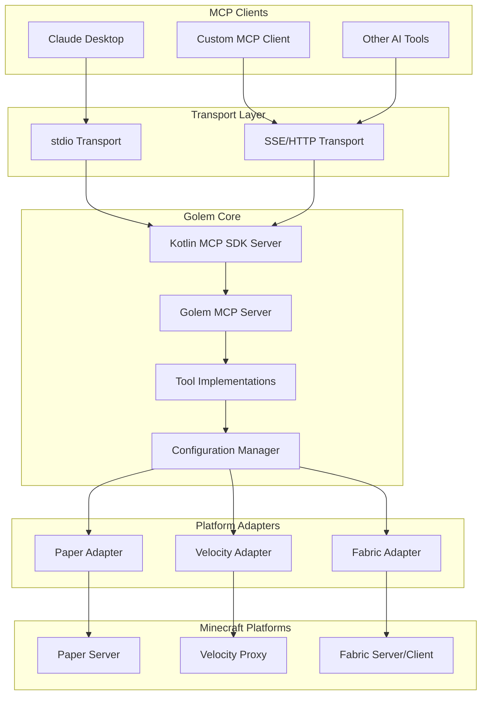

# Golem MCP Server - Architecture Plan

## Project Overview

Golem is a Minecraft plugin/mod that provides an integrated MCP (Model Context Protocol) server, similar to how BlueMap provides an integrated HTTP server for world rendering. This allows AI assistants and other MCP clients to interact with Minecraft servers through a standardized protocol.

## Technology Stack

- **Language**: Kotlin
- **Primary Platform**: Paper (Bukkit/Spigot)
- **Secondary Platforms**: Velocity (proxy), Fabric (client/server mod)
- **Build System**: Gradle with Kotlin DSL
- **MCP SDK**: Official Kotlin MCP SDK (https://github.com/modelcontextprotocol/kotlin-sdk)
- **MCP Protocol**: JSON-RPC 2.0 (handled by SDK)
- **Transports**: stdio and SSE (Server-Sent Events) via SDK

## Architecture Overview



## Module Structure

### 1. Common Module (`golem-common`)
Shared code for all platforms:
- **Kotlin MCP SDK integration**
- Golem MCP Server wrapper
- Tool implementations (player, world, server, admin)
- Platform adapter interface
- Configuration models
- Utility classes

### 2. Paper Module (`golem-paper`)
Paper/Spigot/Bukkit plugin:
- Paper plugin lifecycle
- Bukkit API integration
- Platform-specific tool implementations
- Event listeners
- Command handlers

### 3. Velocity Module (`golem-velocity`)
Velocity proxy plugin:
- Velocity plugin lifecycle
- Proxy-level operations
- Cross-server coordination
- Player routing tools

### 4. Fabric Module (`golem-fabric`)
Fabric mod:
- Fabric mod lifecycle
- Client and server-side support
- Fabric API integration
- Mod compatibility layer

## MCP Server Implementation

### Using Official Kotlin MCP SDK

The Golem plugin leverages the official Kotlin MCP SDK from Anthropic, which provides:

1. **Complete MCP Protocol Implementation**
   - JSON-RPC 2.0 message handling
   - Protocol version negotiation
   - Capability exchange
   - Request/response parsing and validation

2. **Built-in Transport Support**
   - stdio transport (StdioServerTransport)
   - SSE transport (SseServerTransport)
   - Transport abstraction layer

3. **Tool Registration System**
   - Tool interface and base classes
   - Automatic schema generation
   - Tool discovery and listing
   - Execution framework

4. **Error Handling**
   - Standard error codes
   - Error response formatting
   - Exception handling

### Golem MCP Server Wrapper

```kotlin
class GolemMcpServer(
    private val platformAdapter: PlatformAdapter,
    private val config: GolemConfig
) {
    private val server: Server
    
    init {
        server = Server(
            serverInfo = Implementation(
                name = "golem",
                version = "1.0.0"
            ),
            options = ServerOptions(
                capabilities = ServerCapabilities(
                    tools = ToolsCapability()
                )
            )
        )
        registerTools()
    }
    
    suspend fun start(transport: Transport) {
        server.connect(transport)
    }
}
```

### Transport Configuration

#### stdio Transport
```kotlin
val transport = StdioServerTransport()
golemServer.start(transport)
```

#### SSE Transport
```kotlin
val transport = SseServerTransport(
    endpoint = "/mcp/sse",
    port = config.mcp.sse.port,
    host = config.mcp.sse.host
)
golemServer.start(transport)
```

## Core MCP Tools

### Player Management Tools

1. **`list_players`**
   - Lists all online players
   - Returns: username, UUID, location, gamemode, health

2. **`get_player_info`**
   - Detailed info about specific player
   - Parameters: player name or UUID
   - Returns: full player state, inventory, stats

3. **`kick_player`**
   - Kick player from server
   - Parameters: player, reason
   - Requires: operator permission

4. **`ban_player`**
   - Ban player from server
   - Parameters: player, reason, duration (optional)
   - Requires: operator permission

5. **`teleport_player`**
   - Teleport player to location or another player
   - Parameters: player, target (coords or player)
   - Requires: operator permission

### World Information Tools

1. **`list_worlds`**
   - Lists all loaded worlds
   - Returns: world names, types, player counts

2. **`get_world_info`**
   - Detailed world information
   - Parameters: world name
   - Returns: spawn point, time, weather, difficulty, seed

3. **`set_world_time`**
   - Change world time
   - Parameters: world, time
   - Requires: operator permission

4. **`set_world_weather`**
   - Change world weather
   - Parameters: world, weather type
   - Requires: operator permission

### Server Statistics Tools

1. **`get_server_stats`**
   - Current server performance metrics
   - Returns: TPS, memory usage, player count, uptime

2. **`get_server_info`**
   - Server configuration and version info
   - Returns: version, plugins, max players, motd

3. **`get_performance_report`**
   - Detailed performance analysis
   - Returns: chunk stats, entity counts, plugin timings

### Admin Command Tools

1. **`broadcast_message`**
   - Send message to all players
   - Parameters: message, formatting
   - Requires: operator permission

2. **`execute_console_command`**
   - Execute command as console
   - Parameters: command
   - Requires: operator permission
   - Security: Whitelist/blacklist support

3. **`reload_config`**
   - Hot-reload plugin configuration
   - Requires: operator permission

## Configuration System

### Configuration File Structure

```yaml
# config.yml
golem:
  # MCP Server Settings
  mcp:
    enabled: true
    
    # stdio transport
    stdio:
      enabled: true
    
    # SSE/HTTP transport
    sse:
      enabled: true
      port: 3000
      host: "0.0.0.0"
      # Future: authentication settings
    
  # Tool Configuration
  tools:
    # Enable/disable tool categories
    player_management:
      enabled: true
      allowed_tools:
        - list_players
        - get_player_info
        - kick_player
        - ban_player
        - teleport_player
    
    world_info:
      enabled: true
      allowed_tools:
        - list_worlds
        - get_world_info
        - set_world_time
        - set_world_weather
    
    server_stats:
      enabled: true
      allowed_tools:
        - get_server_stats
        - get_server_info
        - get_performance_report
    
    admin_commands:
      enabled: true
      allowed_tools:
        - broadcast_message
        - execute_console_command
        - reload_config
      
      # Command execution security
      command_whitelist: []
      command_blacklist:
        - "stop"
        - "restart"
        - "op"
        - "deop"
  
  # Permission Settings
  permissions:
    # Require permissions for tool access
    require_permissions: true
    
    # Permission nodes (auto-generated based on tools)
    # golem.tool.list_players
    # golem.tool.kick_player
    # etc.
  
  # Logging
  logging:
    level: INFO
    log_tool_usage: true
    log_failed_attempts: true
```

### Hot-Reload Support

Configuration changes will be detected and applied without server restart:
- File watcher for config.yml changes
- Validation before applying changes
- Graceful handling of invalid configurations
- Event notification for config updates

## Permission System

### Permission Nodes

```
golem.admin              - Full access to all tools
golem.tool.*             - Access to all tools
golem.tool.player.*      - Access to all player tools
golem.tool.world.*       - Access to all world tools
golem.tool.server.*      - Access to all server tools
golem.tool.admin.*       - Access to all admin tools

golem.tool.list_players
golem.tool.get_player_info
golem.tool.kick_player
golem.tool.ban_player
golem.tool.teleport_player
golem.tool.list_worlds
golem.tool.get_world_info
golem.tool.set_world_time
golem.tool.set_world_weather
golem.tool.get_server_stats
golem.tool.get_server_info
golem.tool.get_performance_report
golem.tool.broadcast_message
golem.tool.execute_console_command
golem.tool.reload_config
```

### Integration

- Paper: LuckPerms, PermissionsEx, native permissions
- Velocity: LuckPerms, native permissions
- Fabric: Custom permission system or mod integration

## Security Considerations

1. **Command Execution**
   - Whitelist/blacklist for console commands
   - Prevent dangerous operations (stop, op, etc.)
   - Audit logging for all executions

2. **Access Control**
   - Permission-based tool access
   - Future: Authentication for SSE transport
   - Rate limiting for tool calls

3. **Data Exposure**
   - Configurable data filtering
   - Privacy controls for player data
   - Sensitive information masking

## Error Handling

### Error Types

1. **Protocol Errors**
   - Invalid JSON-RPC requests
   - Unsupported protocol versions
   - Malformed tool calls

2. **Permission Errors**
   - Insufficient permissions
   - Disabled tools
   - Unauthorized access attempts

3. **Execution Errors**
   - Player not found
   - World not loaded
   - Command execution failures

### Error Response Format

```json
{
  "jsonrpc": "2.0",
  "id": "request-id",
  "error": {
    "code": -32000,
    "message": "Player not found",
    "data": {
      "player": "NonExistentPlayer",
      "suggestion": "Use list_players to see online players"
    }
  }
}
```

## Testing Strategy

### Unit Tests
- MCP protocol handler
- JSON-RPC engine
- Configuration parser
- Tool implementations (mocked platform)

### Integration Tests
- Full MCP client-server communication
- Platform-specific tool execution
- Configuration hot-reload
- Permission system integration

### Platform Tests
- Paper: Test server environment
- Velocity: Proxy test setup
- Fabric: Development environment

## Build Configuration

### Gradle Module Structure

```
golem/
├── build.gradle.kts (root)
├── settings.gradle.kts
├── gradle/
│   └── libs.versions.toml
├── common/
│   ├── build.gradle.kts
│   └── src/main/kotlin/
├── paper/
│   ├── build.gradle.kts
│   └── src/main/kotlin/
├── velocity/
│   ├── build.gradle.kts
│   └── src/main/kotlin/
└── fabric/
    ├── build.gradle.kts
    └── src/main/kotlin/
```

### Dependencies

**Common Module:**
- **Kotlin MCP SDK** (`io.modelcontextprotocol:kotlin-sdk`)
- Kotlin stdlib
- kotlinx.coroutines
- kotlinx.serialization (JSON)
- SLF4J (logging)

**Paper Module:**
- Paper API
- Common module
- Adventure API (text components)

**Velocity Module:**
- Velocity API
- Common module

**Fabric Module:**
- Fabric API
- Fabric Language Kotlin
- Common module

## Deployment

### Paper Plugin
1. Build JAR with dependencies
2. Place in `plugins/` directory
3. Configure `plugins/Golem/config.yml`
4. Restart or load plugin

### Velocity Plugin
1. Build JAR with dependencies
2. Place in `plugins/` directory
3. Configure `plugins/golem/config.toml`
4. Restart or load plugin

### Fabric Mod
1. Build JAR with dependencies
2. Place in `mods/` directory
3. Configure `config/golem.json`
4. Restart server/client

## Documentation Requirements

1. **Installation Guide**
   - Platform-specific installation steps
   - Configuration examples
   - Troubleshooting common issues

2. **MCP Tool Reference**
   - Complete tool catalog
   - Parameter descriptions
   - Example requests/responses
   - Permission requirements

3. **Configuration Reference**
   - All configuration options
   - Default values
   - Hot-reload behavior
   - Security best practices

4. **Developer Guide**
   - Adding custom tools
   - Platform adapter development
   - Contributing guidelines

5. **MCP Client Examples**
   - Claude Desktop configuration
   - Custom client implementation
   - Integration examples

## Future Enhancements

1. **Authentication & Authorization**
   - API keys for SSE transport
   - OAuth2 integration
   - Role-based access control

2. **Additional Tools**
   - Economy integration (Vault)
   - Plugin management
   - Backup operations
   - Whitelist management

3. **Resources**
   - Real-time server logs
   - Player chat history
   - Event streams

4. **Prompts**
   - Pre-defined admin workflows
   - Common operation templates
   - Interactive wizards

5. **Multi-Server Support**
   - Cross-server operations via Velocity
   - Server group management
   - Load balancing tools

## Success Metrics

1. **Functionality**
   - All core tools working on Paper
   - Both transports operational
   - Configuration hot-reload working
   - Permission system integrated

2. **Performance**
   - Minimal impact on server TPS
   - Fast tool execution (<100ms for most operations)
   - Efficient memory usage

3. **Usability**
   - Clear documentation
   - Easy installation
   - Intuitive configuration
   - Helpful error messages

4. **Compatibility**
   - Paper 1.21+ support
   - Velocity 3.x support
   - Fabric 1.21+ support
   - Cross-platform feature parity
